# 🚀 Hi, I'm Huynh Tien (HSGamer)

  
  

> **Free-time developer crafting Minecraft plugin ecosystems & building open-source developer tools.**

I'm a passionate self-taught developer from Vietnam who loves turning complex design ideas into elegant, highly-scalable software. By day, I enjoy brainstorming new architectures while riding my bicycle; by night, I build tools, libraries, and frameworks that empower developers and Minecraft server administrators.

---

## 🌐 Organizations & Ecosystems

Many of my core projects are housed in specialized GitHub organizations. Here is where I focus my work:

### 🛠️ [BetterGUI-MC](https://github.com/BetterGUI-MC)
*Home of BetterGUI, a simple yet powerful menu-making framework for Minecraft servers.*
* **[BetterGUI](https://github.com/BetterGUI-MC/BetterGUI)** — A highly customizable chest GUI plugin featuring a robust configuration system and modular addon support.
* **[MaskedGUI](https://github.com/BetterGUI-MC/MaskedGUI)** — Advanced inventory GUI featuring mask layouts.
* **[Addon-List](https://github.com/BetterGUI-MC/Addon-List)** — Central catalog containing all official and community-made BetterGUI addons.

### 📊 [Topper-MC](https://github.com/Topper-MC)
*A framework ecosystem designed to handle single-value data tables and real-time leaderboards.*
* **[Topper](https://github.com/Topper-MC/Topper)** — The core framework for leaderboard aggregation, caching, and placeholder formatting.
* **[Topper-spigot](https://github.com/Topper-MC/Topper-spigot)** — An implementation of the Topper framework specifically tailored for Bukkit/Spigot servers.

### ⚡ [Folia-Inquisitors](https://github.com/Folia-Inquisitors)
*Collaborative effort porting and optimizing essential Spigot plugins for regionalized multi-threaded paper/folia servers.*
* **[MoreFoWorld](https://github.com/Folia-Inquisitors/MoreFoWorld)** — A reference world manager built specifically for Folia servers.
* **[SuperVanish-Folia](https://github.com/Folia-Inquisitors/SuperVanish-Folia)** — Port of the player invisibility plugin.

### 🌐 [ProjectUnified](https://github.com/ProjectUnified)
*Unified libraries, utilities, and frameworks to simplify Minecraft-related development and server administration.*
* **[MCServerUpdater](https://github.com/ProjectUnified/MCServerUpdater)** — Lightweight tool to automate Minecraft server jar updates.
* **[UniDialog](https://github.com/ProjectUnified/UniDialog)** — Fluent API library to easily design and manage Minecraft dialog systems.
* **[UniHologram](https://github.com/ProjectUnified/UniHologram)** — A unified abstraction layer for managing holograms across multiple hologram provider plugins.
* **[UniItem](https://github.com/ProjectUnified/UniItem)** — A unified abstraction layer for managing items across multiple item provider plugins.
* **[CraftItem](https://github.com/ProjectUnified/CraftItem)** — A library for crafting items in Minecraft.
* **[CraftUX](https://github.com/ProjectUnified/CraftUX)** — A library for making grid-like GUIs, mostly for Minecraft plugins.

---

## 🌟 Highlighted Personal Projects

* **[HSGamer/HSCore](https://github.com/HSGamer/HSCore)** — The core utility dependency library that powers all my Minecraft plugins and personal Java tools.
* **[HSGamer/typst-mmdr](https://github.com/HSGamer/typst-mmdr)** — A Typst plugin that integrates and compiles Mermaid diagrams natively using WebAssembly.

---

## 🔮 Upcoming Projects

* **[HSGamer/BetterDungeons](https://github.com/HSGamer/BetterDungeons)** — A dungeon plugin for Minecraft servers.
* **[TestState](https://github.com/TestState)** — A centralized test case management system.

---

## 💻 Tech Stack

### 🗣️ Languages

### ⚙️ Frameworks & Ecosystems

### 🗄️ Databases

### 🎨 Design & Utilities

---

## 📊 Stats & Footprint

  
  

  
  

  

---

## ✉️ Connect With Me

  
  
  
  
  
  

## 💰 Support My Work

If you find my projects helpful and would like to support their ongoing development, any donation is greatly appreciated!

 

